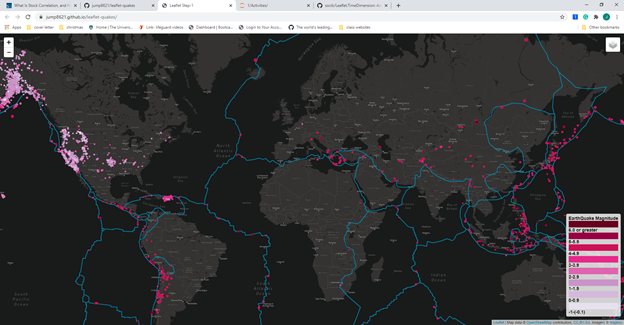
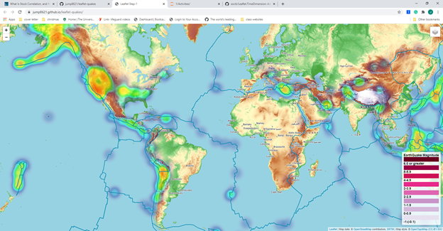
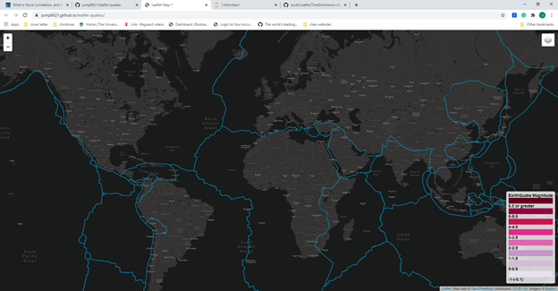
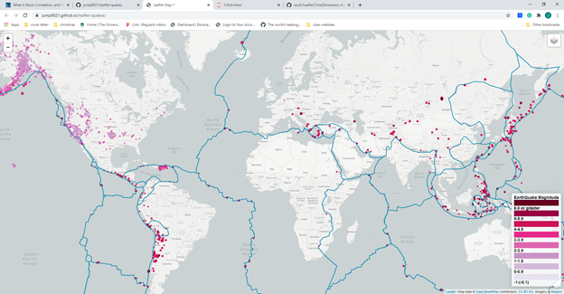
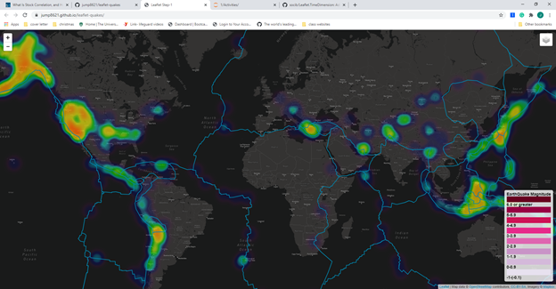

# leaflet-quakes

https://jump8621.github.io/leaflet-quakes/

The scale on the map for the magnitude goes to -1 because the USGS.gov site said the typical values for mag, or magnitude was between -1 and 10.  

The map has two additional overlays, in the layer control, cycling and hiking, a visual to help determine if there would be an increase in the number of trails around fault lines that produced mountains and hills.

The popup's to the earthquake's include the number of people who <b>felt</b> the earthquake because I thought that was interesting, and I wanted to include the depth the earthquake occured as well, but didn't want to overload with information.  I also wasn't sure I could convey how the depth of the earthquake could change the effect of the earthquake clearly enough in the popup.

Below are pictures of the map with different layers and overlays:

